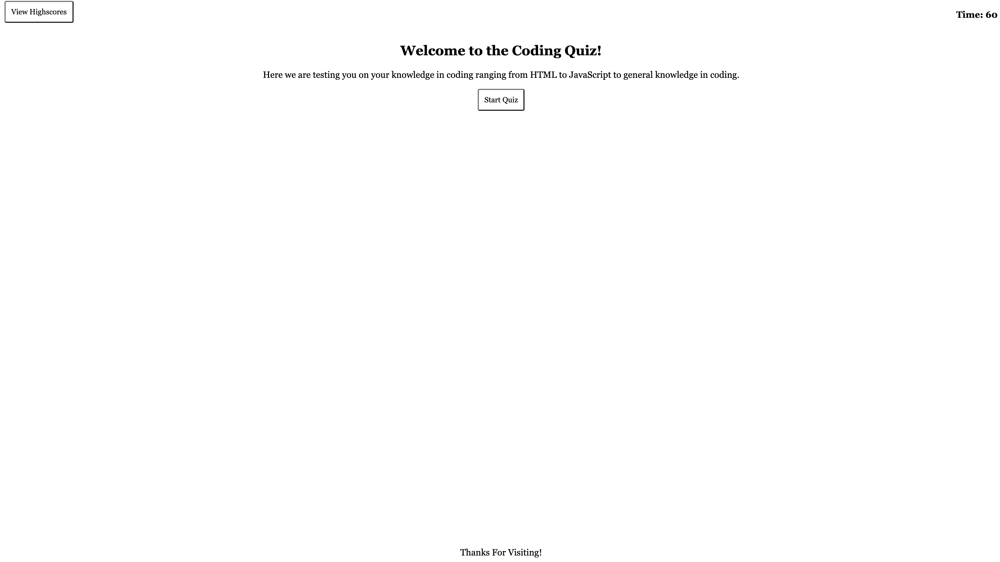
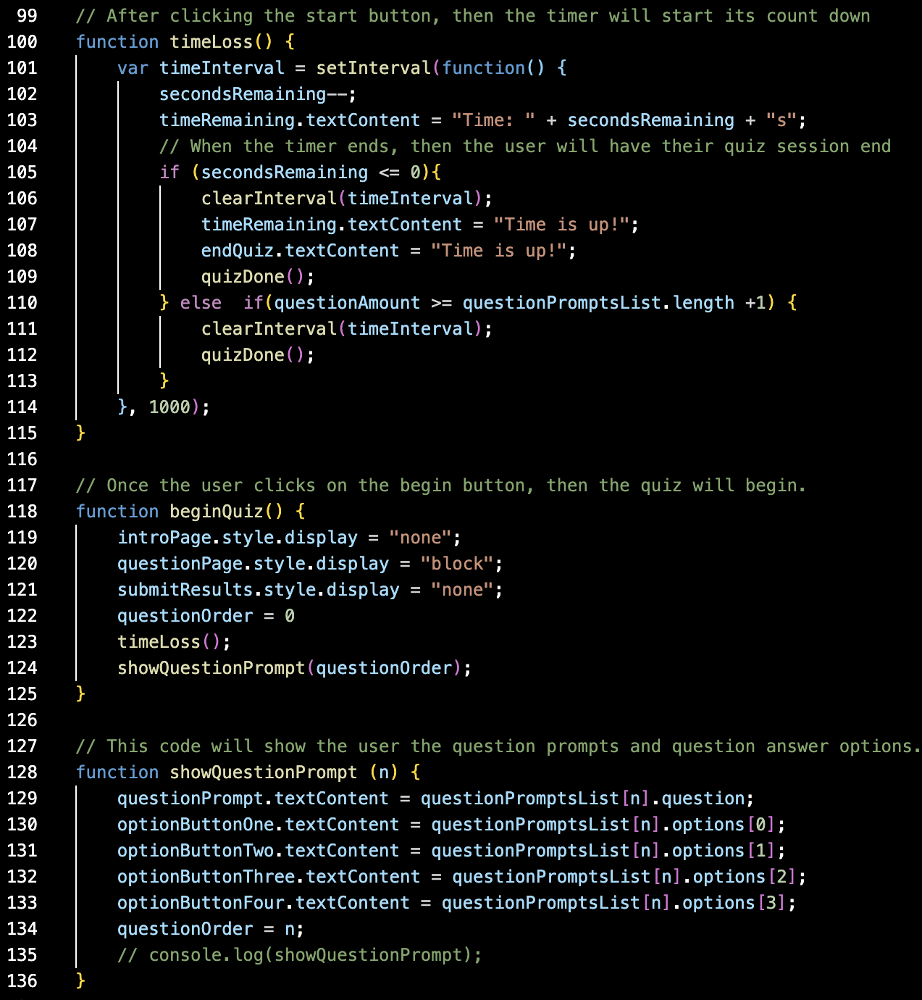
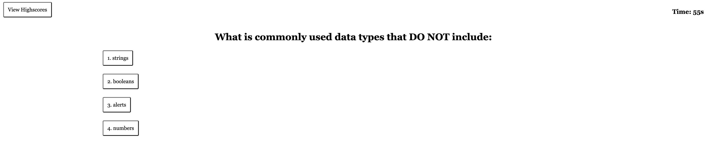
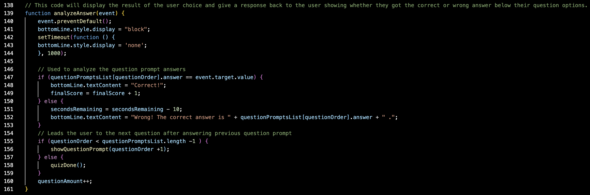
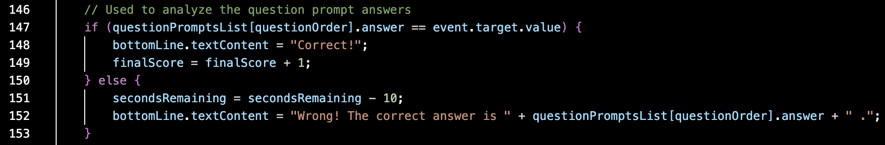

# Code-Quiz

Learning to use JavaScript can be a difficult process for some, while for others it comes naturally to them. To improve upon my skills as a coder, I decided to create a small coding quiz that tests the user with questions relating to coding. These test questions range from HTML questions to JavaScript questions to generally known knowledge of coding.

## Objectives
To compete this project, I give myself a specific acceptance criteria that this project should be capable of doing.

Step 1, when the user clicks the start button, then the timer starts a countdown as well as providing the user with a question.
Step 2, when the user answers a question, then the user will be provided with another question.
Step 3, when the user answers a question incorrectly, then the some time is subtracted from the countdown timer.
Step 4, when the user answers all the questions or the timer ends its countdown at 0, then the user is presented with a "end of quiz" screen.
Step 5, when the game is over, the user is able to save their initials and their score.

## Step 1

In both of these images we are able to see that the code that is being provided helps the user to start the timer and the quiz with a question.

## Step 2

.png)
.png)
In the first image, we can see that the code is checking if the input the user put in is correct, but after that code at the bottom of the function we see that the questions are being provided after every answer the user provides. The last two images just show how it is being shown through the HTML.

## Step 3

Inn the previous step we saw the function that was being used to anaylze the user input. Now that we take a closer look into that function, in the image above, shows that every time a user gets an incorrect answer then 10 seconds will be subtracted from their timer.

## Step 4

